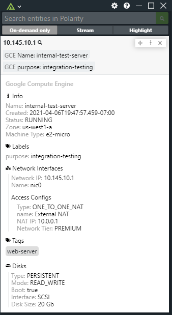
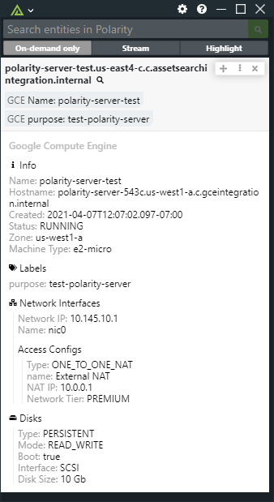
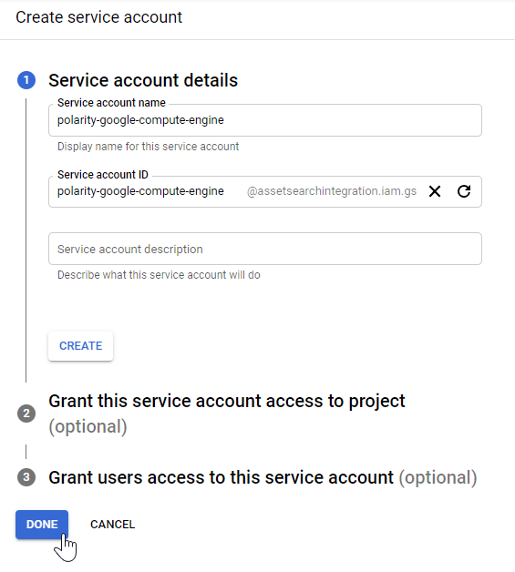
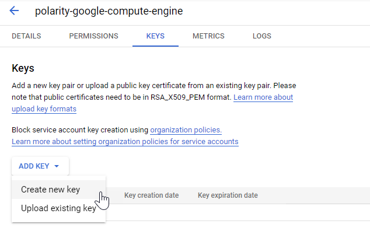
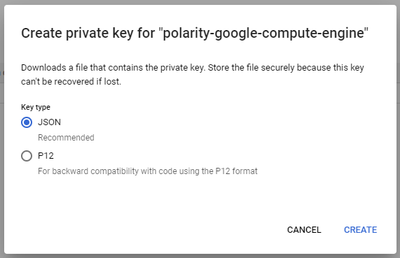
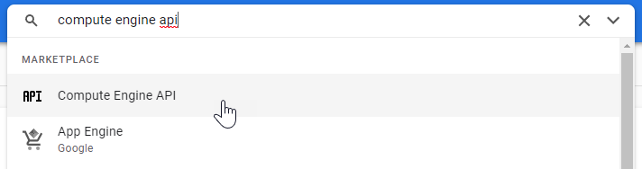
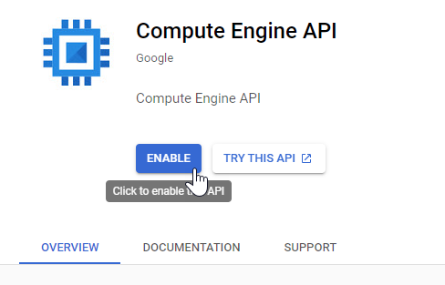

# Polarity Google Compute Engine Integration


Polarity's Google Compute Engine integration gives users the ability to lookup IP addresses and hostnames for VM instances in your Google Compute Engine infrastructure.  The integration supports both internal and external IP lookups, and internal and custom hostnames.  Internal hostnames must end in `.internal` and custom hostnames must end in a public suffix to be recognized.  

|  |  |
|---|---|
|*IP Lookup of VM Instance* | *Internal Hostname Lookup of VM Instance*|

## How does it work?

The integration uses the Google Compute Engine REST API to fetch instance information for the specified project.  In order to provide fast lookups on external and internal IP addresses associated with VM Instances as well as both ZonalDNS and custom hostnames, the integration will cache IP address, hostname, and zone information in memory when it first starts.  This works by fetching 500 instances at a time from the Google Compute Engine REST API and building an in-memory map of the data which maps IP and hostname to an instance ID and zone.  When a lookup request is sent for an IP address or host, the in-memory map is checked for a hit before the full instance details are retrieved.

By default, the integration will refresh the in-memory cache when it is restarted and then once every 24 hours at midnight.  You can adjust this refresh interval by providing your own CRON tab string via the "Instance Cache Update Cron" option.

In addition to custom hostnames, the integration will also build the internal (local) domain name using Zonal DNS rules.

For more information about the endpoints used please see:

* Cache all IPs:  https://cloud.google.com/compute/docs/reference/rest/v1/instances/aggregatedList
* Get instance details: https://cloud.google.com/compute/docs/reference/rest/v1/instances/get

For more information on internal DNS names please see: https://cloud.google.com/compute/docs/internal-dns#about_internal_dns

> For customers with large numbers of GCE VM instances, please contact us at <a href="mailto:support@polarity.io">support@polarity.io</a> so we can assist with tuning the integration

> The integration will only search instances that are part of the project associated with the provided service account key

## Google Compute Engine Integration Options

### Instance Cache Update Cron

A cron schedule string which is used to determine how often to update the in-memory GCE instance cache.  The default value is "0 0 * * *" which runs once a day at midnight.  Currently, W (nearest weekday) and L (last day of month/week) are not supported. This option must be set to "Only Admins can View and Edit".

## Installation Instructions

Installation instructions for integrations are provided on the [PolarityIO GitHub Page](https://polarityio.github.io/).

## Configuring the Integration

You will need to configure a Google service account key and perform the following steps.

### Create the Project and Service Account

Before you can use the Polarity Google Compute Engine Integration you will need to go to the [Google Developers Console](https://console.developers.google.com/) and create a new project. Provide a name for your project and an ID, which can be generated as well.

After the project has been created, from the left menu, select `Credentials`, then `Create credentials`. Select `Service account key` from the type of credentials list. After this, choose `New service account` from the dropdown and name the service account `polarity-google-compute-engine`.  Under the role selection, choose `Service Accounts -> Service Account User`.  



### Create JSON Key

After the service account is created you will need to navigate to the service and click on the `KEYS` tab.  



From there click on the JSON key option



### Enable the API

Next we need to enable the API which will be used with this service account. To do that, use the search input at the top of the screen and search for and select “Compute Engine API”.



On the Compute Engine API screen click on the Enable API button



### Transfer Service Account Key to Polarity server

SSH into the Polarity Server as root and navigate to the Google Compute Engine integration subdirectory:

```
cd /app/polarity-server/integrations/google-compute-engine
```

Create a new directory named `key` and upload the service account key created in Step 1 above, or optionally copy the contents of the key file into a new file named `privatekey.json`.  After the key file has uploaded or created, make the `key` directory and its contents owned by the polarityd user:

```
chown -R polarityd:polarityd /app/polarity-server/integrations/google-compute-engine/key/
```

> PLEASE NOTE: If the key file is not explicitly named `privatekey.json` or is placed in an alternate location, the integration configuration file (config.js) needs to be modified to reflect this change.

```
auth:{
    // Path to google compute engine private key file
    key: './key/privatekey.json'
}
```

## About Polarity

Polarity is a memory-augmentation platform that improves and accelerates analyst decision making.  For more information about the Polarity platform please see:

https://polarity.io/
